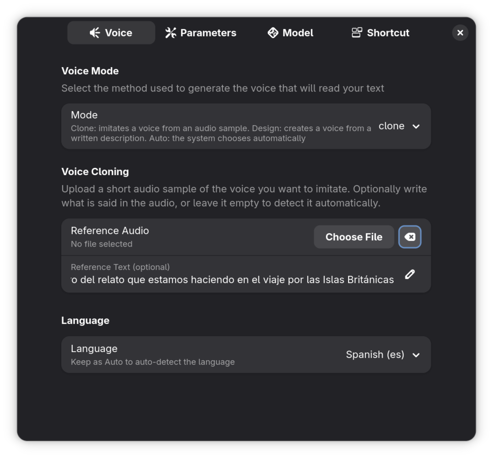
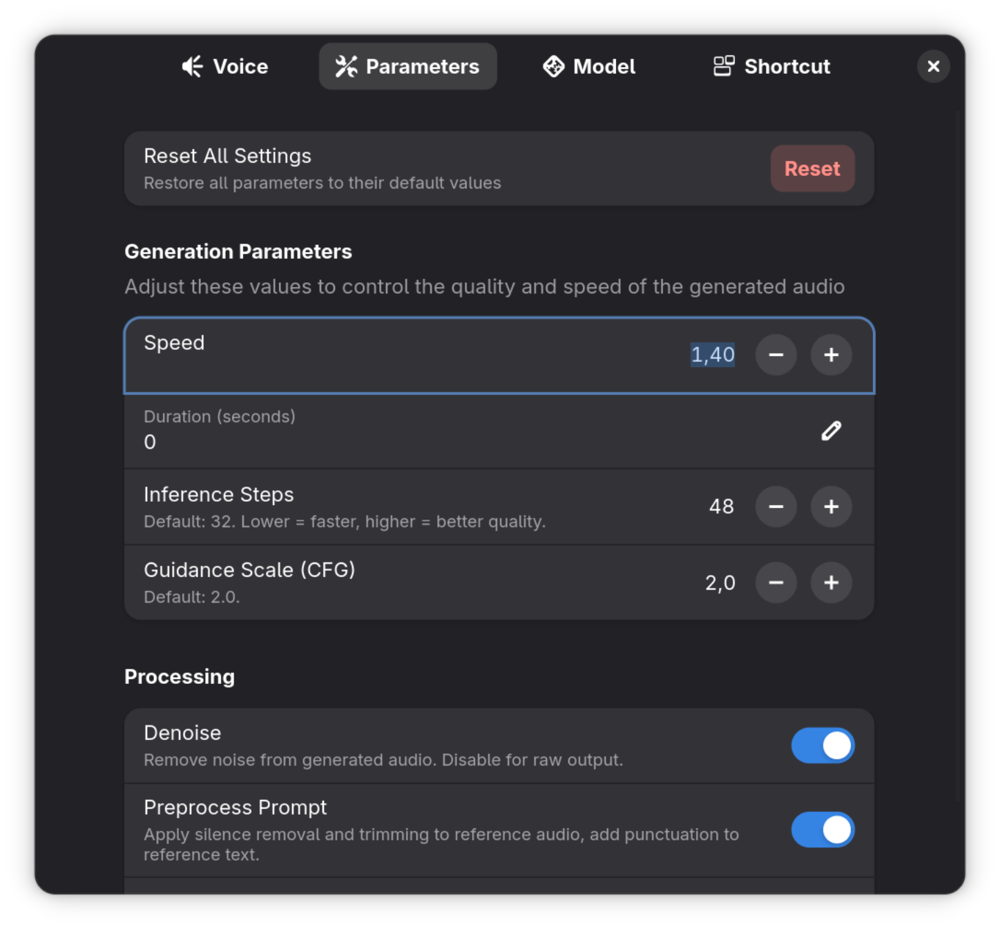
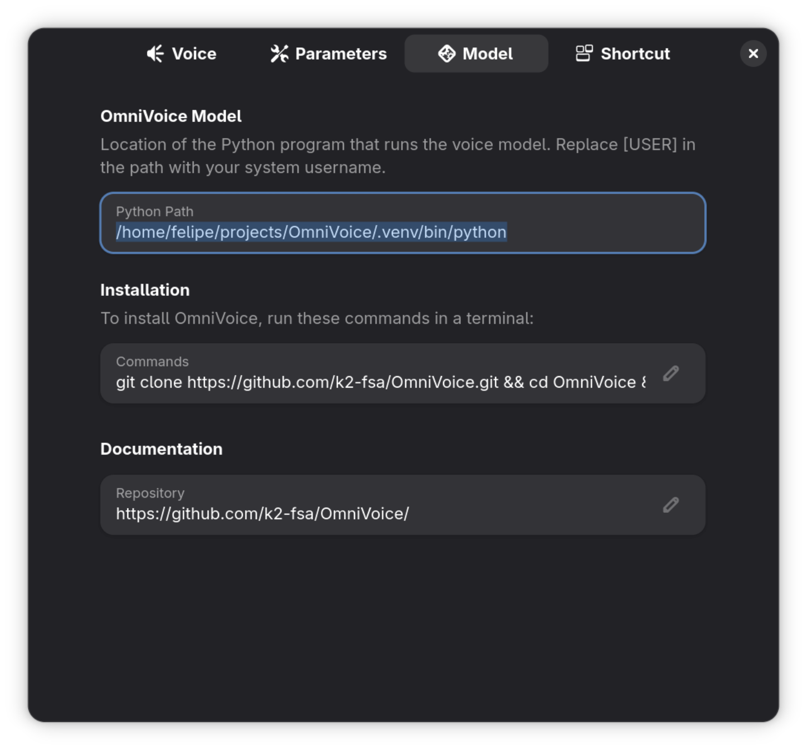
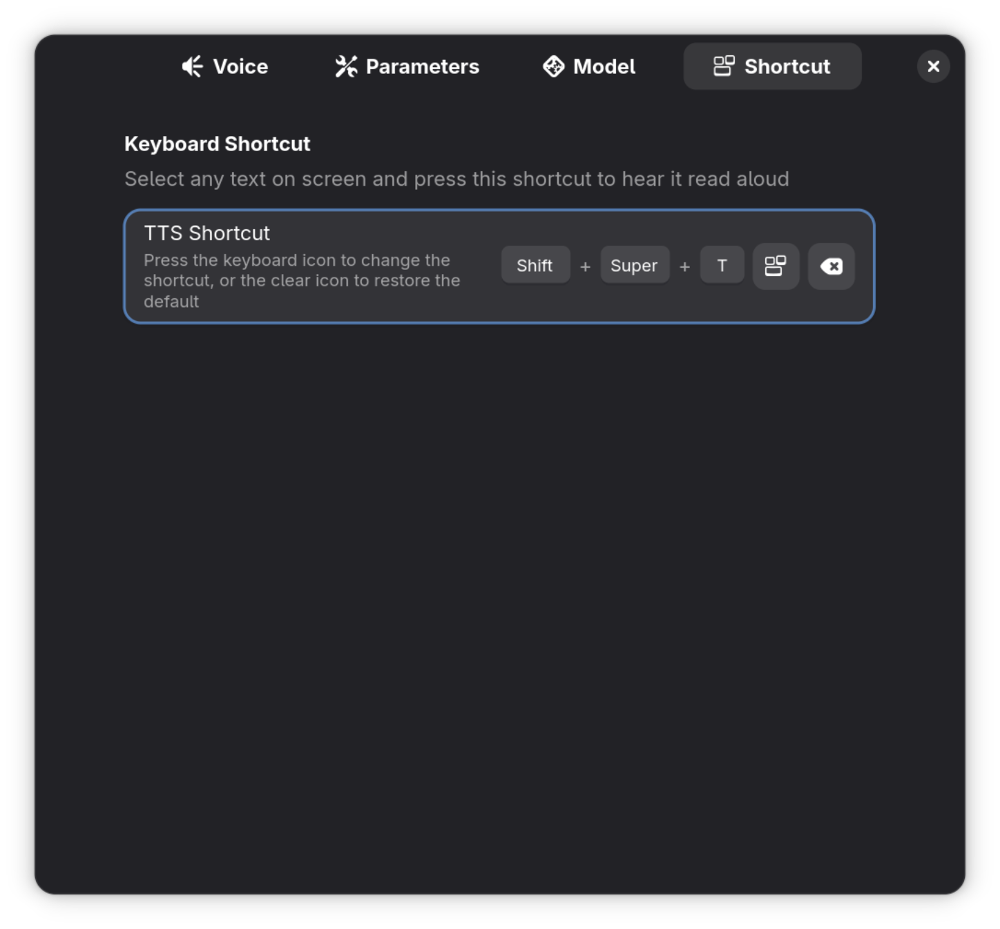

# Plane TTS

GNOME Shell extension that reads selected text aloud using [OmniVoice](https://github.com/k2-fsa/OmniVoice) for high-quality text-to-speech with voice cloning, voice design, or automatic mode.

<details>
<summary>Screenshots</summary>
   
   
   
   
</details>

## Requirements

- GNOME Shell 49 or 50
- Python 3 with [OmniVoice](https://github.com/k2-fsa/OmniVoice) installed in a virtualenv
- NVIDIA GPU with CUDA (or Apple Silicon with MPS, or Intel Arc with XPU)
- `paplay` (included with PulseAudio/PipeWire)

## Installation

### 1. Install OmniVoice

```bash
git clone https://github.com/k2-fsa/OmniVoice.git && cd OmniVoice && uv sync && uv pip install -e .
```

### 2. Install the extension

```bash
git clone https://github.com/wfpaisa/plane-tts.git
cd plane-tts
bun run build
bash install.sh
```

### 3. Enable

Log out and back in (required on Wayland), then:

```bash
gnome-extensions enable plane-tts@wfelipe.com
```

### 4. Configure

```bash
gnome-extensions prefs plane-tts@wfelipe.com
```

Set the Python path to your OmniVoice virtualenv in the **Model** tab (e.g. `/home/you/OmniVoice/.venv/bin/python`).

## Usage

1. Select text in any application
2. Press **Super+Shift+T** (default shortcut) or click the panel icon → **Read Selection**
3. The panel icon changes color to indicate status:
   - Yellow: generating audio
   - Green: playing
   - Red: error (resets after 3 seconds)
4. To stop playback: click the panel icon → **Stop**

## Preferences

- **Voice**: choose between clone (from audio sample), design (from text description), or auto mode
- **Parameters**: inference steps, speed, duration, guidance scale, processing toggles
- **Model**: Python path, installation commands, documentation link
- **Shortcut**: customize the keyboard shortcut

## Development

See [docs/readme-dev.md](docs/readme-dev.md) for build commands, project structure, translations, and debugging instructions.

```sh
# Install the extension (symlink + compile schemas)
bun run install:extension

# Enable the extension in GNOME Shell
bun run enable

# Disable the extension
bun run disable

# Open the preferences panel
bun run prefs

# View all GNOME Shell logs in real time
bun run logs

# View only Plane TTS logs
bun run logs:extension

# Open a nested GNOME Shell session for testing
bun run wayland:session
```

## Licencia

MIT
